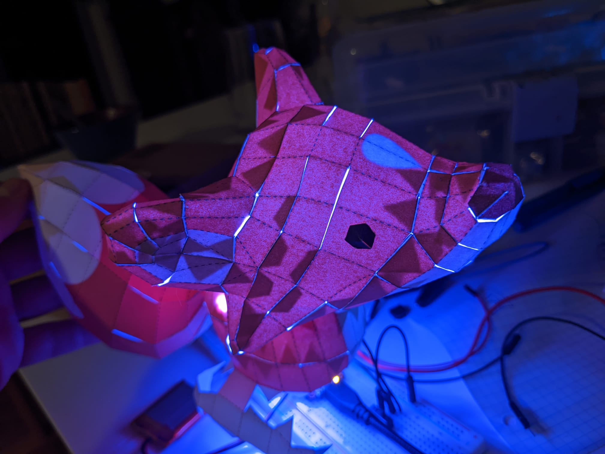
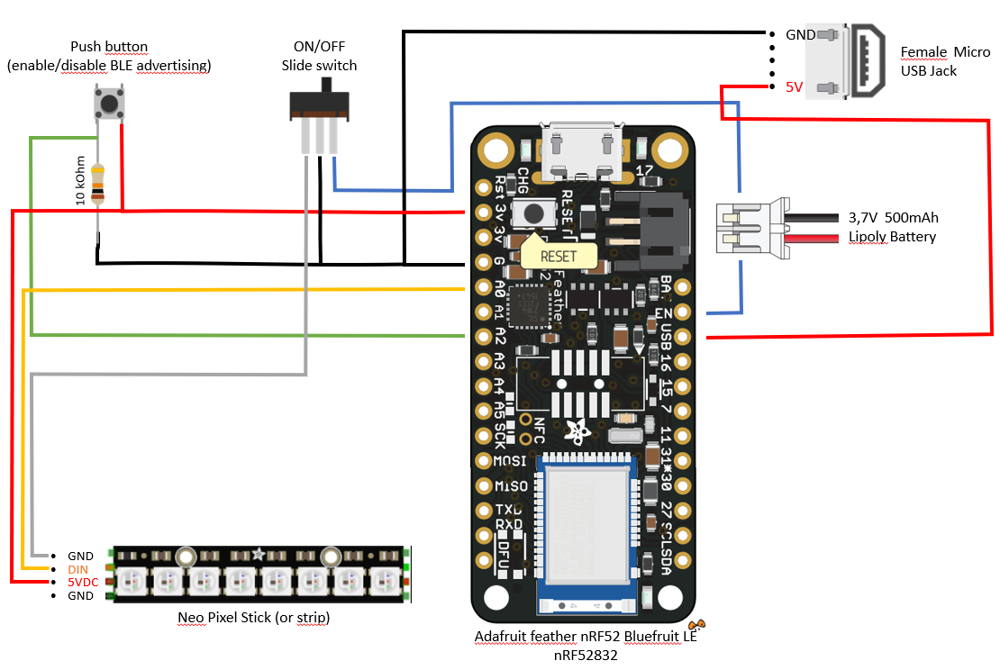

# BLE Lamp 

3D papercraft enhanced with BLE controlled RGB LED strip.
This repository contains:
 - the pdf for a Baby Fox 3D papercraft
 - schematic for the arduino circuit (based on Adafruit Feather BLE board)
 - the Arduino code for the board

## Arduino Circuit

The circuit's key elements are:
 - Bluefruit Feather nRF52 from Adafruit : arduino board empowered with BLE. You can use any other BLE enabled Arduino board, or Arduino board + BLE module.
 - Adressable LED strip (in my case 8 Neo Pixels stick). Number of LEDs in the strip can be simply change thanks to the use of Adafruit's NeoPixel library (watchout the power supply if you use a large number of LEDs: in my case for 8 LEDs, the 3V supply from the board is enough but not sure if that would be enough for 128 LEDs, probably not)
 - Lipoly Battery so the Lamp can be wireless
 - ON/OFF switch for the Lamp (if the lamp is plugged in, the switch only turns the LEDs OFF)
 - Push Button to enable/disable BLE functionnality of the board
 - (Optional) Female Micro USB Jack to relocalize the USB port of the lamp away from the board 

